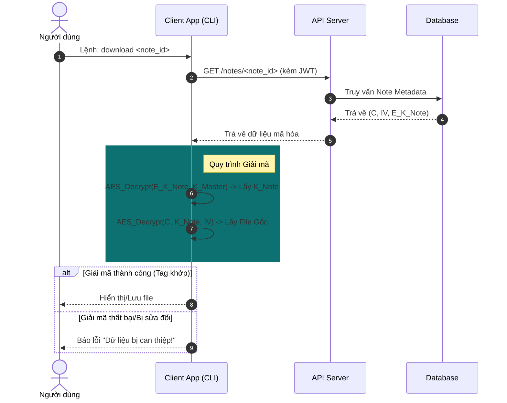

```mermaid
sequenceDiagram
    autonumber
    actor User as Người dùng
    participant Client as Client App (CLI)
    participant Server as API Server
    participant DB as Database

    User->>Client: Lệnh: download <note_id>
    Client->>Server: GET /notes/<note_id> (kèm JWT)
    Server->>DB: Truy vấn Note Metadata
    DB-->>Server: Trả về (C, IV, E_K_Note)
    Server-->>Client: Trả về dữ liệu mã hóa
    
    rect rgba(13, 113, 113, 1)
    note right of Client: Quy trình Giải mã
    Client->>Client: AES_Decrypt(E_K_Note, K_Master) -> Lấy K_Note
    Client->>Client: AES_Decrypt(C, K_Note, IV) -> Lấy File Gốc
    end
    
    alt Giải mã thành công (Tag khớp)
        Client-->>User: Hiển thị/Lưu file
    else Giải mã thất bại/Bị sửa đổi
        Client-->>User: Báo lỗi "Dữ liệu bị can thiệp!"
    end
```