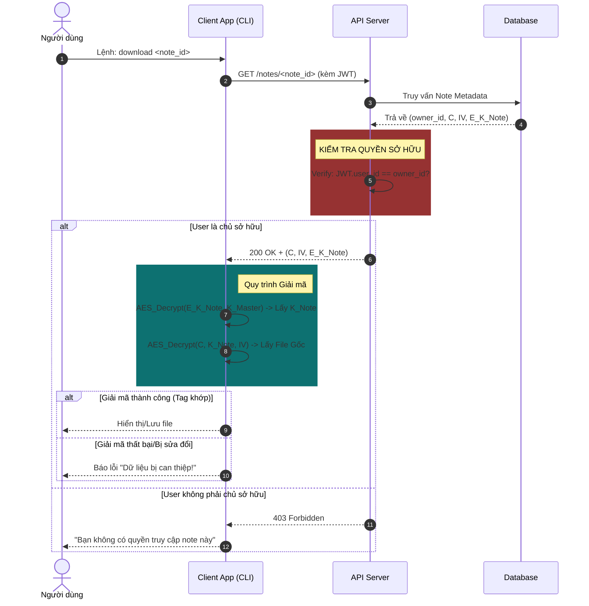

```mermaid
sequenceDiagram
    autonumber
    actor User as Người dùng
    participant Client as Client App (CLI)
    participant Server as API Server
    participant DB as Database

    User->>Client: Lệnh: download <note_id>
    Client->>Server: GET /notes/<note_id> (kèm JWT)
    
    Server->>DB: Truy vấn Note Metadata
    DB-->>Server: Trả về (owner_id, C, IV, E_K_Note)
    
    rect rgba(150, 50, 50, 1)
    Note over Server: KIỂM TRA QUYỀN SỞ HỮU
    Server->>Server: Verify: JWT.user_id == owner_id?
    end
    
    alt User là chủ sở hữu
        Server-->>Client: 200 OK + (C, IV, E_K_Note)
        
        rect rgba(13, 113, 113, 1)
        note right of Client: Quy trình Giải mã
        Client->>Client: AES_Decrypt(E_K_Note, K_Master) -> Lấy K_Note
        Client->>Client: AES_Decrypt(C, K_Note, IV) -> Lấy File Gốc
        end
        
        alt Giải mã thành công (Tag khớp)
            Client-->>User: Hiển thị/Lưu file
        else Giải mã thất bại/Bị sửa đổi
            Client-->>User: Báo lỗi "Dữ liệu bị can thiệp!"
        end
        
    else User không phải chủ sở hữu
        Server-->>Client: 403 Forbidden
        Client-->>User: "Bạn không có quyền truy cập note này"
    end
```