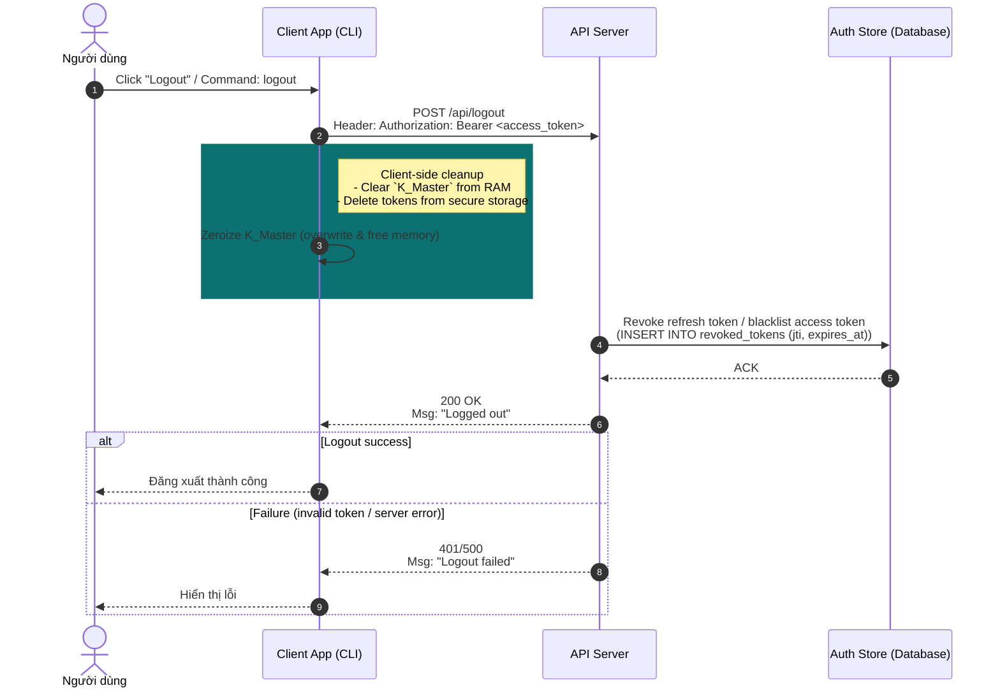

```mermaid
sequenceDiagram
    autonumber
    actor User as Người dùng
    participant Client as Client App (CLI)
    participant Server as API Server
    participant Auth as Auth Store (Database)

    User->>Client: Click "Logout" / Command: logout
    Client->>Server: POST /api/logout<br/>Header: Authorization: Bearer <access_token>

    rect rgba(13,113,113,1)
    note right of Client: Client-side cleanup<br/>- Clear `K_Master` from RAM<br/>- Delete tokens from secure storage
    Client->>Client: Zeroize K_Master (overwrite & free memory)
    end

    Server->>Auth: Revoke refresh token / blacklist access token<br/>(INSERT INTO revoked_tokens (jti, expires_at))
    Auth-->>Server: ACK

    Server-->>Client: 200 OK<br/>Msg: "Logged out"

    alt Logout success
        Client-->>User: Đăng xuất thành công
    else Failure (invalid token / server error)
        Server-->>Client: 401/500<br/>Msg: "Logout failed"
        Client-->>User: Hiển thị lỗi
    end
```
