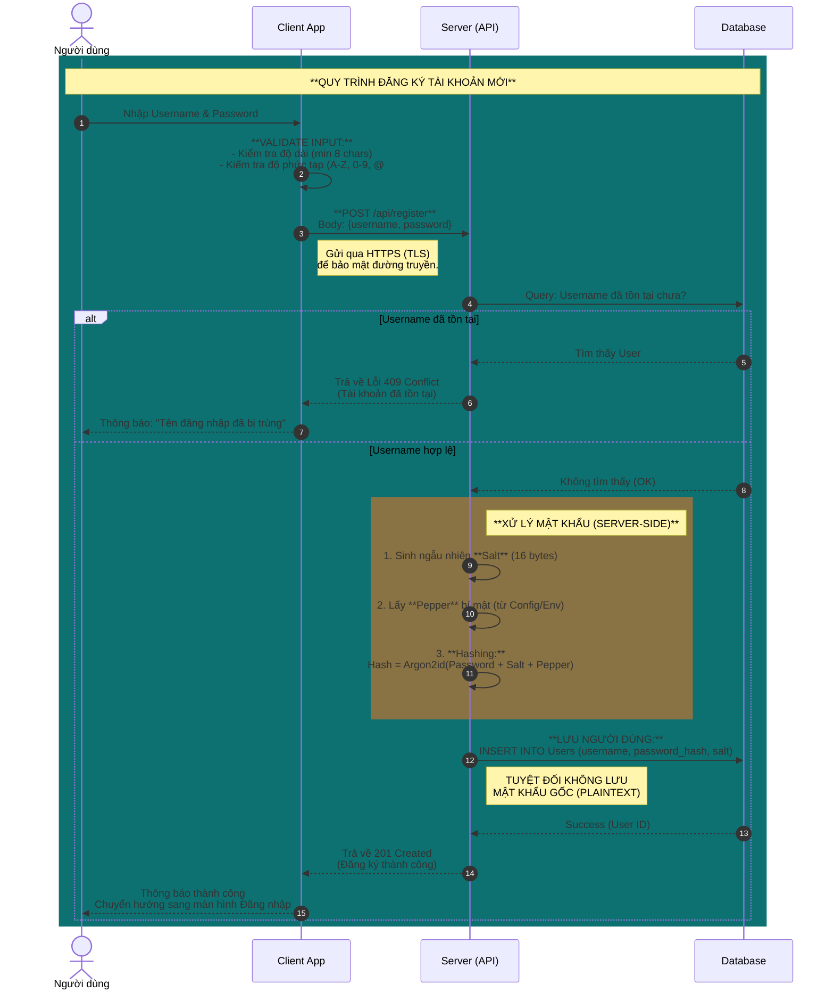

```mermaid
sequenceDiagram
  autonumber
  actor User as Người dùng
  participant Client as Client App
  participant Server as Server (API)
  participant DB as Database

  %% --- GIAI ĐOẠN ĐĂNG KÝ ---
  rect rgb(13, 113, 113)
    Note over User, DB: **QUY TRÌNH ĐĂNG KÝ TÀI KHOẢN MỚI**

    User->>Client: Nhập Username & Password
    
    Client->>Client: **VALIDATE INPUT:**<br/>- Kiểm tra độ dài (min 8 chars)<br/>- Kiểm tra độ phức tạp (A-Z, 0-9, @#$...)

    Client->>Server: **POST /api/register**<br/>Body: {username, password}
    Note right of Client: Gửi qua HTTPS (TLS)<br/>để bảo mật đường truyền.

    Server->>DB: Query: Username đã tồn tại chưa?
    
    alt Username đã tồn tại
        DB-->>Server: Tìm thấy User
        Server-->>Client: Trả về Lỗi 409 Conflict<br/>(Tài khoản đã tồn tại)
        Client-->>User: Thông báo: "Tên đăng nhập đã bị trùng"
    else Username hợp lệ
        DB-->>Server: Không tìm thấy (OK)
        
        %% --- XỬ LÝ HASHING ---
        rect rgba(137, 114, 67, 1)
            Note right of Server: **XỬ LÝ MẬT KHẨU (SERVER-SIDE)**
            Server->>Server: 1. Sinh ngẫu nhiên **Salt** (16 bytes)
            Server->>Server: 2. Lấy **Pepper** bí mật (từ Config/Env)
            Server->>Server: 3. **Hashing:**<br/>Hash = Argon2id(Password + Salt + Pepper)
        end

        Server->>DB: **LƯU NGƯỜI DÙNG:**<br/>INSERT INTO Users (username, password_hash, salt)
        Note right of Server: TUYỆT ĐỐI KHÔNG LƯU<br/>MẬT KHẨU GỐC (PLAINTEXT)
        
        DB-->>Server: Success (User ID)
        
        Server-->>Client: Trả về 201 Created<br/>(Đăng ký thành công)
        
        Client-->>User: Thông báo thành công<br/>Chuyển hướng sang màn hình Đăng nhập
    end
  end
```