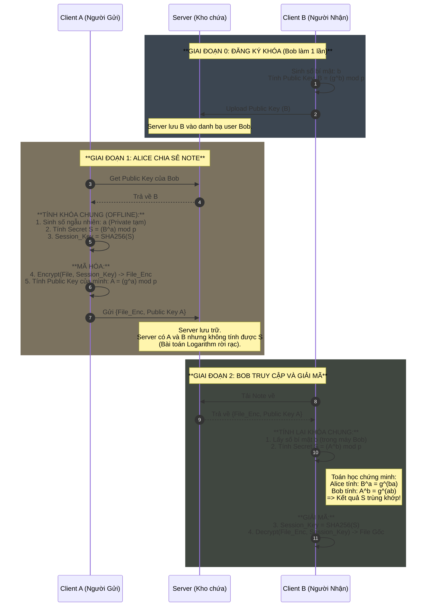

```mermaid
sequenceDiagram
  autonumber
  participant Alice as Client A (Người Gửi)
  participant Server as Server (Kho chứa)
  participant Bob as Client B (Người Nhận)

  %% --- GIAI ĐOẠN CHUẨN BỊ ---
  rect rgba(60, 70, 81, 1)
    Note over Bob, Server: **GIAI ĐOẠN 0: ĐĂNG KÝ KHÓA (Bob làm 1 lần)**
    Bob->>Bob: Sinh số bí mật: b<br/>Tính Public Key: B = (g^b) mod p
    Bob->>Server: Upload Public Key (B)
    Note over Server: Server lưu B vào danh bạ user Bob.
  end

  %% --- GIAI ĐOẠN CHIA SẺ ---
  rect rgba(123, 114, 95, 1)
    Note over Alice, Server: **GIAI ĐOẠN 1: ALICE CHIA SẺ NOTE**
    
    Alice->>Server: Get Public Key của Bob
    Server-->>Alice: Trả về B
    
    Alice->>Alice: **TÍNH KHÓA CHUNG (OFFLINE):**<br/>1. Sinh số ngẫu nhiên: a (Private tạm)<br/>2. Tính Secret S = (B^a) mod p<br/>3. Session_Key = SHA256(S)
    
    Alice->>Alice: **MÃ HÓA:**<br/>4. Encrypt(File, Session_Key) -> File_Enc<br/>5. Tính Public Key của mình: A = (g^a) mod p
    
    Alice->>Server: Gửi {File_Enc, Public Key A}
    Note over Server: Server lưu trữ.<br/>Server có A và B nhưng không tính được S<br/>(Bài toán Logarithm rời rạc).
  end

  %% --- GIAI ĐOẠN TRUY CẬP ---
  rect rgba(64, 71, 64, 1)
    Note over Bob, Server: **GIAI ĐOẠN 2: BOB TRUY CẬP VÀ GIẢI MÃ**
    
    Bob->>Server: Tải Note về
    Server-->>Bob: Trả về {File_Enc, Public Key A}
    
    Bob->>Bob: **TÍNH LẠI KHÓA CHUNG:**<br/>1. Lấy số bí mật b (trong máy Bob)<br/>2. Tính Secret S = (A^b) mod p
    
    Note right of Bob: Toán học chứng minh:<br/>Alice tính: B^a = g^(ba)<br/>Bob tính: A^b = g^(ab)<br/>=> Kết quả S trùng khớp!
    
    Bob->>Bob: **GIẢI MÃ:**<br/>3. Session_Key = SHA256(S)<br/>4. Decrypt(File_Enc, Session_Key) -> File Gốc
  end
```