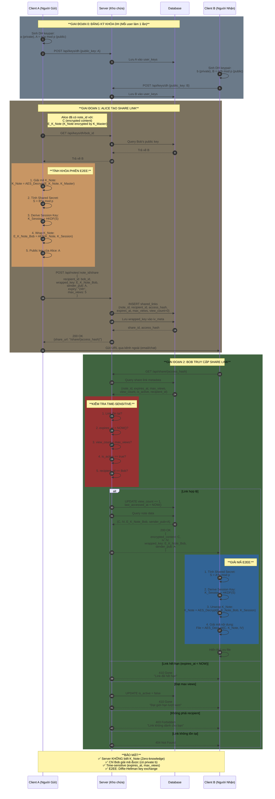

```mermaid
sequenceDiagram
  autonumber
  participant Alice as Client A (Người Gửi)
  participant Server as Server (Kho chứa)
  participant DB as Database
  participant Bob as Client B (Người Nhận)

  %% --- GIAI ĐOẠN 0: ĐĂNG KÝ KHÓA DH ---
  rect rgba(107, 122, 137, 1)
    Note over Alice, DB: **GIAI ĐOẠN 0: ĐĂNG KÝ KHÓA DH (Mỗi user làm 1 lần)**
    
    Alice->>Alice: Sinh DH keypair:<br/>a (private), A = g^a mod p (public)
    Alice->>Server: POST /api/keys/dh {public_key: A}
    Server->>DB: Lưu A vào user_keys
    
    Bob->>Bob: Sinh DH keypair:<br/>b (private), B = g^b mod p (public)
    Bob->>Server: POST /api/keys/dh {public_key: B}
    Server->>DB: Lưu B vào user_keys
  end

  %% --- GIAI ĐOẠN 1: CHIA SẺ NOTE ---
  rect rgba(123, 114, 95, 1)
    Note over Alice, DB: **GIAI ĐOẠN 1: ALICE TẠO SHARE LINK**
    
    Note right of Alice: Alice đã có note_id với:<br/>C (encrypted content)<br/>E_K_Note (K_Note encrypted by K_Master)
    
    Alice->>Server: GET /api/keys/dh/bob_id
    Server->>DB: Query Bob's public key
    DB-->>Server: Trả về B
    Server-->>Alice: Trả về B
    
    rect rgba(200, 150, 100, 1)
    Note right of Alice: **TÍNH KHÓA PHIÊN E2EE:**
    Alice->>Alice: 1. Giải mã K_Note:<br/>K_Note = AES_Decrypt(E_K_Note, K_Master)
    Alice->>Alice: 2. Tính Shared Secret:<br/>S = B^a mod p
    Alice->>Alice: 3. Derive Session Key:<br/>K_Session = HKDF(S)
    Alice->>Alice: 4. Wrap K_Note:<br/>E_K_Note_Bob = AES(K_Note, K_Session)
    Alice->>Alice: 5. Public key của Alice: A
    end
    
    Alice->>Server: POST /api/notes/:note_id/share<br/>{<br/>  recipient_id: bob_id,<br/>  wrapped_key: E_K_Note_Bob,<br/>  sender_pub: A,<br/>  expiry: "24h",<br/>  max_views: 5<br/>}
    
    Server->>DB: INSERT shared_links<br/>(note_id, recipient_id, access_hash,<br/>expires_at, max_views, view_count=0)
    Server->>DB: Lưu wrapped_key vào iv_meta
    DB-->>Server: share_id, access_hash
    
    Server-->>Alice: 200 OK<br/>{share_url: "/share/{access_hash}"}
    Alice->>Bob: Gửi URL qua kênh ngoài (email/chat)
  end

  %% --- GIAI ĐOẠN 2: TRUY CẬP LINK ---
  rect rgba(64, 100, 64, 1)
    Note over Bob, DB: **GIAI ĐOẠN 2: BOB TRUY CẬP SHARE LINK**
    
    Bob->>Server: GET /api/share/{access_hash}
    
    Server->>DB: Query share link metadata
    DB-->>Server: (note_id, expires_at, max_views,<br/>view_count, is_active, recipient_id)
    
    rect rgba(150, 50, 50, 1)
    Note over Server: **KIỂM TRA TIME-SENSITIVE:**
    Server->>Server: 1. Link tồn tại?
    Server->>Server: 2. expires_at > NOW()?
    Server->>Server: 3. view_count < max_views?
    Server->>Server: 4. is_active == true?
    Server->>Server: 5. recipient_id == Bob?
    end
    
    alt Link hợp lệ
        Server->>DB: UPDATE view_count += 1,<br/>last_accessed_at = NOW()
        
        Server->>DB: Query note data
        DB-->>Server: (C, IV, E_K_Note_Bob, sender_pub=A)
        
        Server-->>Bob: 200 OK<br/>{<br/>  encrypted_content: C,<br/>  iv: IV,<br/>  wrapped_key: E_K_Note_Bob,<br/>  sender_pub: A<br/>}
        
        rect rgba(50, 100, 150, 1)
        Note right of Bob: **GIẢI MÃ E2EE:**
        Bob->>Bob: 1. Tính Shared Secret:<br/>S = A^b mod p
        Bob->>Bob: 2. Derive Session Key:<br/>K_Session = HKDF(S)
        Bob->>Bob: 3. Unwrap K_Note:<br/>K_Note = AES_Decrypt(E_K_Note_Bob, K_Session)
        Bob->>Bob: 4. Giải mã nội dung:<br/>File = AES_Decrypt(C, K_Note, IV)
        end
        
        Bob->>Bob: Hiển thị/Lưu file
        
    else Link hết hạn (expires_at < NOW)
        Server-->>Bob: 410 Gone<br/>"Link đã hết hạn"
        
    else Đạt max views
        Server->>DB: UPDATE is_active = false
        Server-->>Bob: 410 Gone<br/>"Đạt giới hạn lượt xem"
        
    else Không phải recipient
        Server-->>Bob: 403 Forbidden<br/>"Link không dành cho bạn"
        
    else Link không tồn tại
        Server-->>Bob: 404 Not Found
    end
  end
  
  Note over Alice, Bob: **BẢO MẬT:**<br/>✅ Server KHÔNG biết K_Note (Zero-knowledge)<br/>✅ Chỉ Bob giải mã được (có private b)<br/>✅ Time-sensitive (expires_at, max_views)<br/>✅ E2EE: Diffie-Hellman key exchange
```