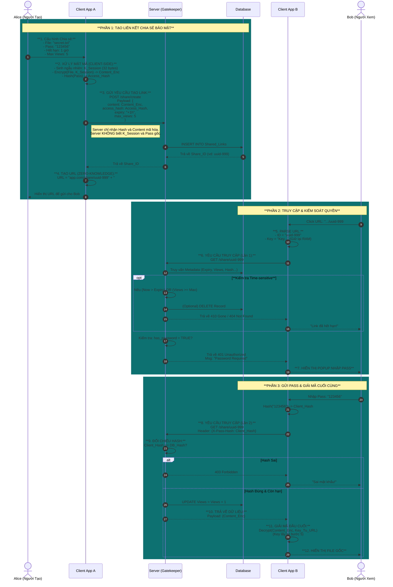

```mermaid
sequenceDiagram
  autonumber
  
  %% --- ĐỊNH NGHĨA CÁC ACTOR ---
  actor Alice as Alice (Người Tạo)
  participant ClientA as Client App A
  participant Server as Server (Gatekeeper)
  participant DB as Database
  participant ClientB as Client App B
  actor Bob as Bob (Người Xem)

  %% ==========================================================
  %% PHẦN 1: TẠO URL CHIA SẺ (SHARE FLOW)
  %% ==========================================================
  rect rgb(13, 113, 113)
    Note over Alice, DB: **PHẦN 1: TẠO LIÊN KẾT CHIA SẺ BẢO MẬT**
    
    Alice->>ClientA: **1. Cấu hình Chia sẻ:**<br/>- File: "secret.txt"<br/>- Pass: "123456"<br/>- Hết hạn: 1 giờ<br/>- Max Views: 5
    
    ClientA->>ClientA: **2. XỬ LÝ MẬT MÃ (CLIENT-SIDE):**<br/>- Sinh ngẫu nhiên: K_Session (32 bytes)<br/>- Encrypt(File, K_Session) -> Content_Enc<br/>- Hash(Pass) -> Access_Hash
    
    ClientA->>Server: **3. GỬI YÊU CẦU TẠO LINK:**<br/>POST /share/create<br/>Payload: {<br/>  content: Content_Enc,<br/>  access_hash: Access_Hash,<br/>  expiry: "+1h",<br/>  max_views: 5<br/>}
    Note right of ClientA: Server chỉ nhận Hash và Content mã hóa.<br/>Server KHÔNG biết K_Session và Pass gốc.
    
    Server->>DB: INSERT INTO Shared_Links
    DB-->>Server: Trả về Share_ID (vd: uuid-999)
    
    Server-->>ClientA: Trả về Share_ID
    
    ClientA->>ClientA: **4. TẠO URL (ZERO-KNOWLEDGE):**<br/>URL = "app.com/share/uuid-999" + "#" + Base64(K_Session)
    
    ClientA-->>Alice: Hiển thị URL để gửi cho Bob
  end

  %% ==========================================================
  %% PHẦN 2: TRUY CẬP VÀ XÁC THỰC (ACCESS FLOW)
  %% ==========================================================
  rect rgb(13, 113, 113)
    Note over Bob, DB: **PHẦN 2: TRUY CẬP & KIỂM SOÁT QUYỀN**
    
    Bob->>ClientB: Click URL: ".../uuid-999#Key..."
    
    ClientB->>ClientB: **5. PARSE URL:**<br/>- ID = "uuid-999"<br/>- Key = "Key..." (Giữ lại RAM)
    
    ClientB->>Server: **6. YÊU CẦU TRUY CẬP (Lần 1):**<br/>GET /share/uuid-999
    
    Server->>DB: Truy vấn Metadata (Expiry, Views, Hash...)
    
    %% --- LOGIC KIỂM TRA THỜI GIAN/QUOTA ---
    opt **Kiểm tra Time-sensitive**
        Server->>Server: Nếu (Now > Expiry) OR (Views >= Max)
        Server->>DB: (Optional) DELETE Record
        Server-->>ClientB: Trả về 410 Gone / 404 Not Found
        ClientB-->>Bob: "Link đã hết hạn!"
        %% Kết thúc luồng nếu lỗi
    end
    
    %% --- LOGIC KIỂM TRA MẬT KHẨU ---
    Server->>Server: Kiểm tra: has_password = TRUE?
    Server-->>ClientB: Trả về 401 Unauthorized<br/>Msg: "Password Required"
    
    ClientB-->>Bob: **7. HIỂN THỊ POPUP NHẬP PASS**
  end

  %% ==========================================================
  %% PHẦN 3: XÁC THỰC PASS & GIẢI MÃ (DECRYPTION FLOW)
  %% ==========================================================
  rect rgb(13, 113, 113)
    Note over Bob, DB: **PHẦN 3: GỬI PASS & GIẢI MÃ CUỐI CÙNG**
    
    Bob->>ClientB: Nhập Pass: "123456"
    ClientB->>ClientB: Hash("123456") -> Client_Hash
    
    ClientB->>Server: **8. YÊU CẦU TRUY CẬP (Lần 2):**<br/>GET /share/uuid-999<br/>Header: {X-Pass-Hash: Client_Hash}
    
    Server->>Server: **9. ĐỐI CHIẾU HASH:**<br/>Client_Hash == DB_Hash?
    
    alt Hash Sai
        Server-->>ClientB: 403 Forbidden
        ClientB-->>Bob: "Sai mật khẩu!"
    else Hash Đúng & Còn hạn
        Server->>DB: UPDATE Views = Views + 1
        Server-->>ClientB: **10. TRẢ VỀ DỮ LIỆU:**<br/>Payload: {Content_Enc}
        
        ClientB->>ClientB: **11. GIẢI MÃ ĐẦU CUỐI:**<br/>Decrypt(Content_Enc, Key_Tu_URL)<br/>(Key lấy từ bước 5)
        
        ClientB-->>Bob: **12. HIỂN THỊ FILE GỐC**
    end
  end
```