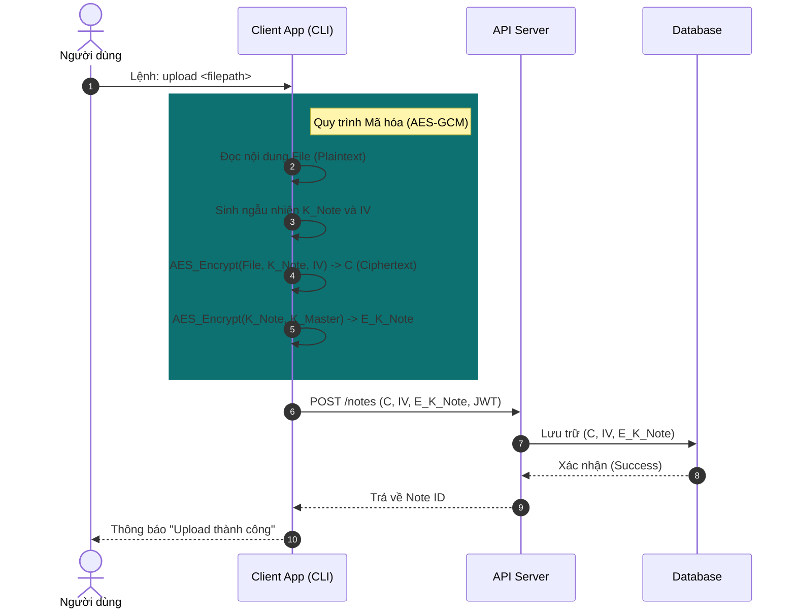

```mermaid
sequenceDiagram
    autonumber
    actor User as Người dùng
    participant Client as Client App (CLI)
    participant Server as API Server
    participant DB as Database

    User->>Client: Lệnh: upload <filepath>
    
    rect rgba(13, 113, 113, 1)
    note right of Client: Quy trình Mã hóa (AES-GCM)
    Client->>Client: Đọc nội dung File (Plaintext)
    Client->>Client: Sinh ngẫu nhiên K_Note và IV
    Client->>Client: AES_Encrypt(File, K_Note, IV) -> C (Ciphertext)
    Client->>Client: AES_Encrypt(K_Note, K_Master) -> E_K_Note
    end
    
    Client->>Server: POST /notes (C, IV, E_K_Note, JWT)
    Server->>DB: Lưu trữ (C, IV, E_K_Note)
    DB-->>Server: Xác nhận (Success)
    Server-->>Client: Trả về Note ID
    Client-->>User: Thông báo "Upload thành công"
```