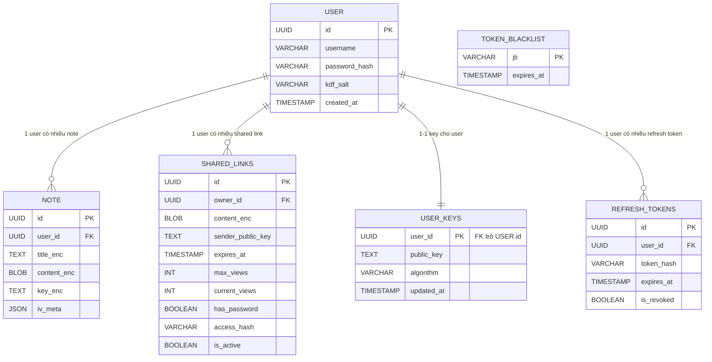

```mermaid
erDiagram
    USER {
        UUID id PK
        VARCHAR username
        VARCHAR password_hash
        VARCHAR kdf_salt
        TIMESTAMP created_at
    }

    NOTE {
        UUID id PK
        UUID user_id FK
        TEXT title_enc
        BLOB content_enc
        TEXT key_enc
        JSON iv_meta
    }

    SHARED_LINKS {
        UUID id PK
        UUID owner_id FK
        BLOB content_enc
        TEXT sender_public_key
        TIMESTAMP expires_at
        INT max_views
        INT current_views
        BOOLEAN has_password
        VARCHAR access_hash
        BOOLEAN is_active
    }

USER_KEYS {
    UUID user_id PK "FK trỏ USER.id"
    TEXT public_key
    VARCHAR algorithm
    TIMESTAMP updated_at
}


    REFRESH_TOKENS {
        UUID id PK
        UUID user_id FK
        VARCHAR token_hash
        TIMESTAMP expires_at
        BOOLEAN is_revoked
    }

    TOKEN_BLACKLIST {
        VARCHAR jti PK
        TIMESTAMP expires_at
    }

    %% Quan hệ
    USER ||--o{ NOTE : "1 user có nhiều note"
    USER ||--o{ SHARED_LINKS : "1 user có nhiều shared link"
    USER ||--|| USER_KEYS : "1-1 key cho user"
    USER ||--o{ REFRESH_TOKENS : "1 user có nhiều refresh token"
```